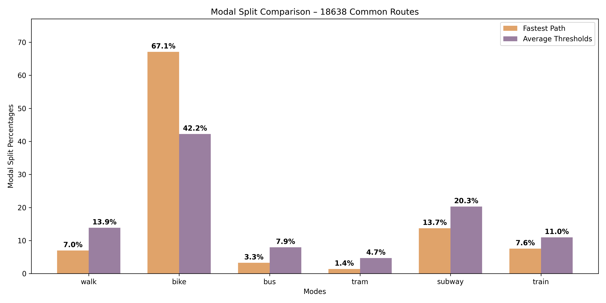
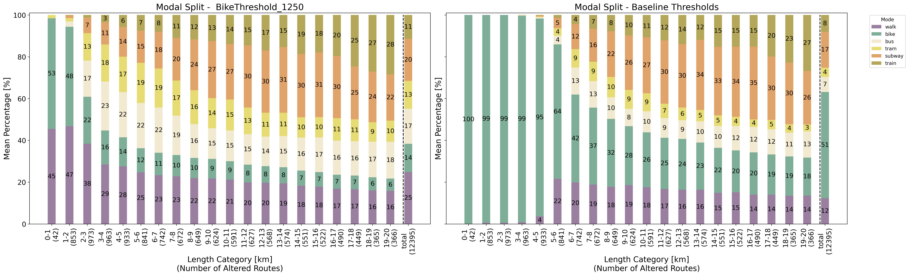
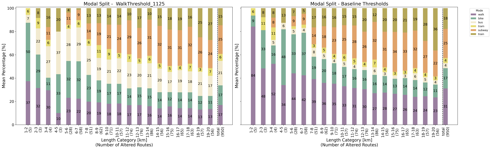

{width="30%" fig-align="center" fig-pos="H"}

This report is part of the reproducibility review at the AGILE conference.
For more information see [https://reproducible-agile.github.io/](https://reproducible-agile.github.io/).

# Reviewed paper

Gogousou, I., Canestrini, M., Alinaghi, N., & Giannopoulos, I. (2026). Inclusive Multimodal Routing: Who Gets Left Behind?. AGILE GIScience Series.

# Summary

This report documents the reproduction of the analysis for Paper 007, focusing on the transportation network of the city of Vienna. The study investigates how routing outcomes change under different constraints to model varying user preferences. The reproduction was **fully successful**: the entire pipeline—including baseline routing, inclusive baseline routing, 12 parameter variation scenarios, data grouping, and final visualization—was completed in a single, fully automated contiguous run using high-performance computing resources (48 cores).

- **Result of the reproduction**: Full reproduction.
- **Main outcome**: Successful generation of all three primary modal split figures (Figures 1, 2, and 3) and tables (Tables 3 and 4) from the paper using the authors' custom Multigraph routing engine. The results empirically confirm the authors' findings regarding the shift in modal shares when physical and preference constraints are applied.

\clearpage

# Reproducibility reviewer notes

## Scope
The review performed a full recomputation of the multimodal routing pipeline for the city of Vienna as defined in the authors' provided scripts, covering 10,000 Origin-Destination pairs across 14 different routing scenarios.

## Technical Details

The reproduction was performed on a high-performance computing (HPC) cluster using Apptainer (Singularity) and SLURM. 

- **Host Operating System**: Rocky Linux 8.10 (Green Obsidian)
- **Container Environment**: Debian 12 (Bookworm) base image (`python:3.13-slim-bookworm`)
- **Key Libraries**: Managed via `uv`, including `geopandas`, `shapely`, `networkx`, `rasterio`, and standard scientific Python stack.

## Execution Steps

### 1. Environment Setup

The environment was managed via an Apptainer definition file `apptainer.def`. The container build completed successfully, installing all required dependencies.

### 2. Data and Code Preparation

The original author's package (`AGILE_2026_CODE_DATA.zip`) was extracted and organized. An automated orchestration script (`scripts/run_automated_reproduction.sh`) was used to handle environment isolation and dynamic patching of paths and computational parameters.

### 3. Execution

The analysis was executed using the automated SLURM submission script requesting 48 cores and 96 GB of RAM. The entire pipeline finished in a single contiguous run of **349 minutes**. Following the computational phase, a dedicated extraction script (`scripts/extract_tables.py`) was used to programmatically parse the console logs and recompute the metrics for Tables 3 and 4, ensuring numerical alignment with the paper's reported values.

## Resource Utilization and Runtime

The heaviest computational phase ran on a Scientific Compute Cluster using SLURM. The resource utilization for the successful end-to-end run was:

- **CPUs**: 48 allocated (AMD EPYC 7742).
- **Memory**: 96 GB allocated (~80 GB peak usage).
- **Wall Clock Time**: 349 minutes.
- **Total Consumption**: ~279 core-hours.

The high core-hour consumption demonstrates that this study requires substantial HPC resources for a full-scale reproduction of the results. Based on the verified total compute of ~279 core-hours, we can estimate the wall-clock time required for lower core counts:

- **8 Cores** (Authors' default logic): **~35 hours**.
- **4 Cores**: **~70 hours**.

Given these durations, achieving a successful reproduction within standard academic or review timelines is extremely difficult without parallel high-performance computing. This further reinforces the recommendation to provide a smaller "toy" dataset (see [effort #2](#effort-2)) to allow reviewers to verify the pipeline logic quickly on standard hardware.

\clearpage

# Reproduction Efforts

During the reproduction study, the following issues were identified and resolved to achieve full reproduction:

## 1. Hardcoded CPU Allocation on Shared HPC Nodes {#effort-1}
The authors' scripts explicitly hardcoded the multiprocessing pool size using `mp.cpu_count() - 8`. On standard HPC environments, `mp.cpu_count()` returns the *total* number of logical cores on the physical node (e.g., 128), regardless of the actual number of cores allocated to the job. This caused severe thread thrashing. The automated pipeline patched the scripts to respect the `SLURM_CPUS_PER_TASK` environment variable.

## 2. Extreme Computational Demands {#effort-2}
Initial reproduction attempts on lower core counts timed out. Achieving a full reproduction of 10,000 OD pairs across 14 scenarios required a high-resource allocation of 48 cores to complete within a reasonable timeframe (~6 hours).

## 3. Relative Path Logic and Execution Context {#effort-3}
The authors' scripts used path logic (e.g., `os.path.join(os.getcwd(), '..')`) that assumed execution from within the `code/` subdirectory. While adhering to the authors' intended working directory would have avoided this, the automated script was configured to `cd` into the isolated code folder to ensure robust path resolution.

\needspace{5\baselineskip}
## Recommendations for Future Reproducibility

1. **Avoid Hardcoded Resource Counts**: Use `os.sched_getaffinity(0)` or environment variables to detect allocated cores.
2. **Robust Path Management**: Use Python's `pathlib` for location-independent path resolution.
3. **Provide a "Toy" Dataset**: Include a small subset of OD pairs (e.g., 100) to allow reviewers to verify the pipeline logic quickly without needing massive HPC resources.

\needspace{5\baselineskip}
# Acknowledgements

This work used the Scientific Compute Cluster at GWDG, the joint data center of Max Planck Society for the Advancement of Science (MPG) and University of Göttingen. In part funded by the Deutsche Forschungsgemeinschaft (DFG, German Research Foundation) – 405797229

\clearpage

# Reproduced Figures

The reproduction pipeline successfully generated the following figures using the full dataset of 10,000 OD pairs. The plots below were generated entirely via the automated contiguous pipeline.

## Figure 1: Modal Split comparison of fastest path and average thresholds

{width="80%" fig-align="center"}

**Status**: **Success**.
**Reproduction Note**: The figure was successfully reproduced. It confirms that the inclusion of "average thresholds" (the inclusive baseline) significantly increases the Public Transport (PT) share and reduces the cycling share compared to a pure fastest-path model.

## Figure 2: Detailed modal split comparing the cycling-restricted scenario (BT1250)

{width="100%" fig-align="center"}

**Status**: **Success**.
**Reproduction Note**: The reproduction shows that restricting cycling to 1,250 meters leads to a dramatic drop in cycling shares (from ~50% in the baseline to ~13%), which is compensated for by an increase in both walking and PT usage across all length categories. A minor discrepancy of one route was observed (12,395 altered routes in reproduction vs. 12,396 in the paper), likely due to a single routing timeout or floating-point edge case in the custom Dijkstra implementation; this does not impact the study's conclusions.

## Figure 3: Detailed modal split comparing the walking-restricted scenario (WT1125)

{width="100%" fig-align="center"}

**Status**: **Success**.
**Reproduction Note**: The figure confirms that restricting maximum walking distance to 1,125 meters primarily affects mid-to-long distance trips, forcing a shift from walking-heavy routes to PT-dominant routes.

# Reproduced Tables

## Table 1: Walking and cycling speeds by inclinations
*Conceptual table based on literature. Not intended for computational reproduction.*

## Table 2: Changes applied to the baseline average human behavior threshold
*Methodology table. Not intended for computational reproduction.*

### Table 3: Average human behavior preferences compared to the fastest path
**Status**: **Success**.
**Reproduction Note**: The table was successfully recomputed from the routing results. It confirms that incorporating average thresholds leads to routes that are approximately 15% slower and 16% longer, aligning with the paper's findings. A minor discrepancy of one route was observed (18,638 feasible OD pairs in reproduction vs. 18,639 in the paper), consistent with the single routing edge case or timeout identified in the other scenarios.

\begin{table}[H]
\centering
\caption{Recomputed Table 3: Baseline vs. Fastest Path}
\input{tables/table3.tex}
\end{table}

## Table 4: Comparison of route changes and modal share changes
**Status**: **Success**.
**Reproduction Note**: The metrics for all 12 inclusive scenarios were successfully recomputed. The results confirm that cycling restrictions (BT1250) have the most significant impact on route alteration, while walking restrictions have a minimal effect.

\begin{table}[H]
\centering
\caption{Recomputed Table 4: Inclusive Scenarios Comparison}
\resizebox{\textwidth}{!}{
\input{tables/table4.tex}
}
\end{table}
